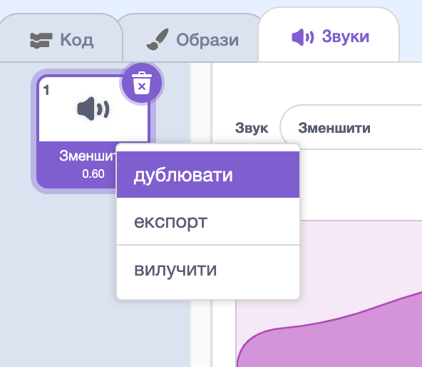

## Заклинання збільшення

<div style="display: flex; flex-wrap: wrap">
<div style="flex-basis: 200px; flex-grow: 1; margin-right: 15px;">
Тобі також потрібне заклинання збільшення, щоб повернути спрайт **Fairy** до нормального розміру або ж щоб створити величезну фею!
</div>
<div>
{:width="300px"}
</div>
</div>

**Порада:** у цій частині ти додаватимеш код до трьох різних спрайтів. Переконайся, що ти вибрав/-ла правильний спрайт зі списку спрайтів під Сценою, і натисни на вкладку **Код**.

--- task ---

Додай скрипт до спрайту кнопки **Збільшити**, щоб `оповістити`{:class="block3events"} за допомогою повідомлення `Збільшити`{:class="block3events"}:


```blocks3
when this sprite clicked
broadcast (grow v)
```

--- /task ---

--- task ---

Додай скрипт до спрайту **Fairy**, щоб він збільшувався:


```blocks3
when I receive [grow v]
change size by [10] // positive numbers increase the size
```

--- /task ---

Ти можеш відтворити звук «Зменшення» у зворотному порядку, щоб отримати звук «Збільшення»!

<p style="border-left: solid; border-width:10px; border-color: #0faeb0; background-color: aliceblue; padding: 10px;">
<span style="color: #0faeb0">**Вікторини з піснями, які відтворюються задом наперед**</span> — музичні вікторини з несподіваним поворотом. Усі пісні відтворюються задом наперед, а учасники мають вгадати початкову пісню — і це не так просто, як здається. 
</p>

--- task ---

Вибери спрайт **Wand** і натисни на вкладку **Звуки**.

Клацни правою кнопкою миші (або натисни й утримуй) звук **Зменшити** та вибери **дублювати**.




Назви копію `Збільшити`.

Клацни на іконку **Обернути**, щоб звук відтворювався у зворотному напрямку.


--- /task ---

--- task ---

Додай скрипт до спрайту **Wand**, щоб звук `Збільшити`{:class="block3sound"} відтворювався, коли отримується повідомлення `Збільшити`{:class="block3events"}:


```blocks3
when I receive [grow v]
play sound [grow v] until done
```

--- /task ---

--- task ---

**Тест:** натискай на кнопки з заклинаннями **Зменшити** і **Збільшити** скільки завгодно разів.

--- /task ---

--- save ---

