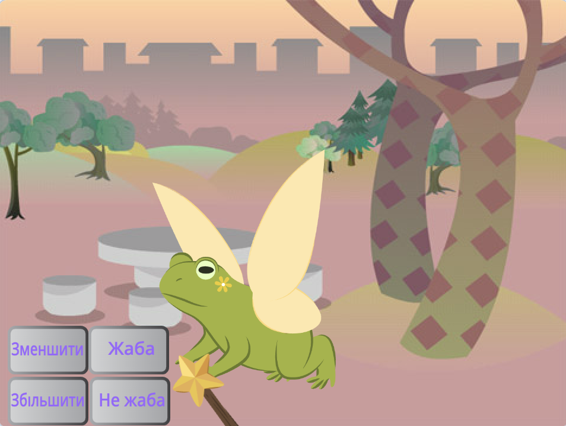
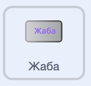
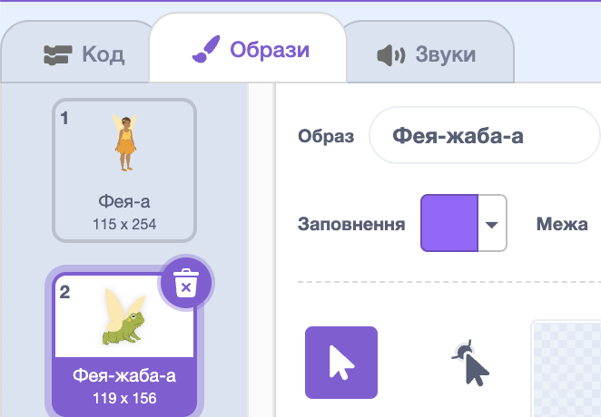
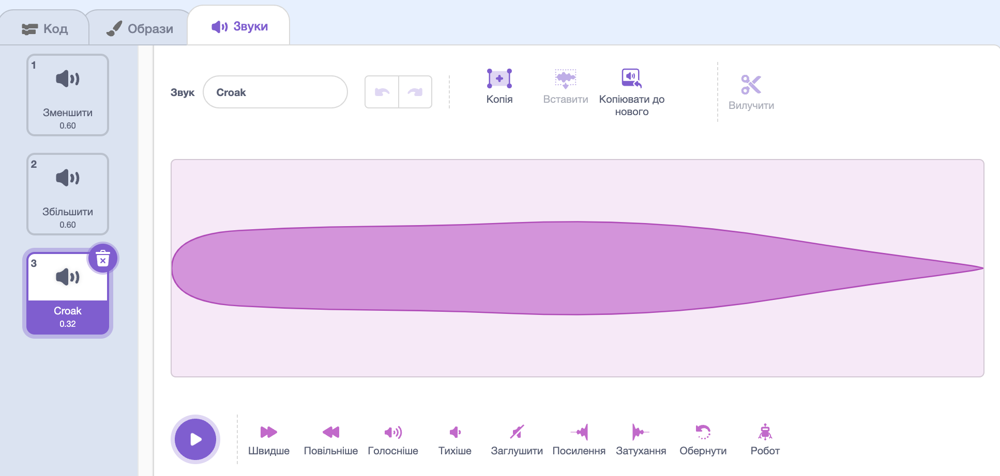
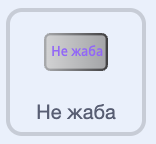
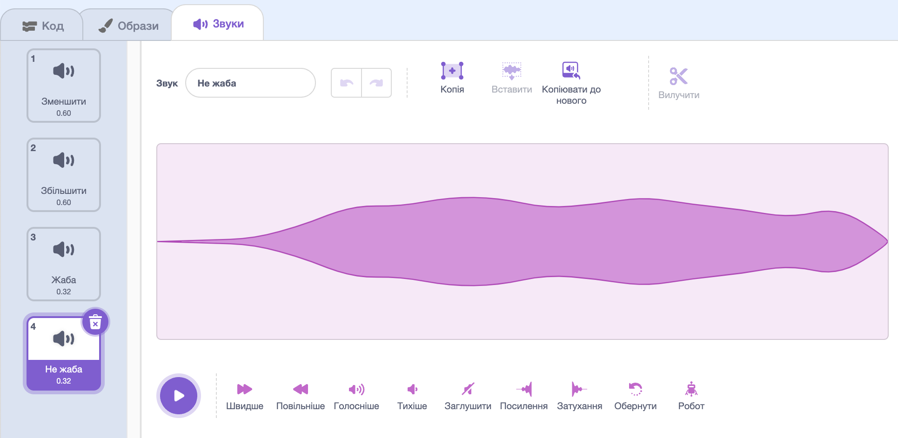

## Перетворення на жабу

<div style="display: flex; flex-wrap: wrap">
<div style="flex-basis: 200px; flex-grow: 1; margin-right: 15px;">
Настав час для ще одного заклинання. Цього разу ти застосуєш заклинання трансформації, передавши повідомлення `Жаба`{:class="block3events"}, яке перетворить спрайт **Fairy** на жабу! 

Можливо, вона готується до пригоди, де корисніше бути жабою.
</div>
<div>
{:width="300px"}
</div>
</div>

--- task ---

Додай скрипт до спрайту кнопки **Жаба**, щоб передати повідомлення «Жаба»:



```blocks3 
when this sprite clicked
broadcast [toad v]
```

--- /task ---

--- task ---

Вибери спрайт **Fairy** та натисни на вкладку **Образи**.

Щоб перетворити спрайт **Fairy** на жабу, ти використаєш образи **Фея-а** і **Фея-жаба-а**.



--- /task ---

--- task ---

Натисни на вкладку **Код** і додай блок `змінити образ на`{:class="block3looks"} в кінець вже наявного скрипта `коли зелений прапорець натиснуто`{:class="block3events"}, щоб коли ти запускатимеш проєкт, фея була в людській формі:


```blocks3
when flag clicked
set size to [100] %
+ switch costume to [Fairy-a v]
```

--- /task ---

--- task ---

Додай новий скрипт до спрайту **Fairy**, щоб перетворити її на жабу:


```blocks3  
when I receive [toad v]
switch costume to [Fairy-toad-a v]
```

--- /task ---

--- task ---

Додай звук **Croak** («квакання» англійською) до спрайту **Wand**.

Перейменуй звук на `Жаба`:




--- /task ---

--- task ---

Додай скрипт до спрайту **Wand**, який дозволить відтворювати звук `Жаба`{:class="block3sound"}, коли ти накладаєш заклинання перетворення на жабу:


```blocks3  
when I receive [toad v]
play sound [toad v] until done
```

--- /task ---

--- task ---

**Тест:** перевір, чи вдається тобі перетворити спрайт **Fairy** на жабу зі звуковим ефектом, коли ти натискаєш на кнопку **Жаба**. Натисни на зелений прапорець, щоби перетворити спрайт **Fairy** назад на людину.


--- /task ---

Протилежним заклинанням до «Жаби» є заклинання «Не жаба».

--- task ---

Додай скрипт до спрайту кнопки **Не жаба**, щоб `оповістити`{:class="block3events"} за допомогою повідомлення 'Не жаба'{:class="block3events"}:



```blocks3 
when this sprite clicked
broadcast [untoad v]
```

--- /task ---

--- task ---

Додай новий скрипт щоб перетворити спрайт **Fairy** на `Не жабу`{:class="block3events"}:


```blocks3  
when I receive [untoad v]
switch costume to [Fairy-a v]
```

--- /task ---

--- task ---

Вибери спрайт **Wand** і перейди до вкладки **Звуки**.

Скопіюй звук **Жаба**, натиснувши **Дублювати** та зміни його назву на `Не жаба`.

Клацни на іконку **Обернути**, щоб звук **Не жаба** відтворювався задом наперед.




--- /task ---

--- task ---

Додай скрипт до спрайту **Wand**, який дозволить відтворювати звук `Не жаба`{:class="block3sound"}:


```blocks3  
when I receive [untoad v]
play sound [untoad v] until done
```

--- /task ---

--- task ---

**Тест:** випробуй заклинання **Жаба** і **Не жаба**, а також спробуй **Зменшити** й **Збільшити** спрайт **Fairy**, коли вона перебуває у формі жаби.

--- /task ---

--- save ---
