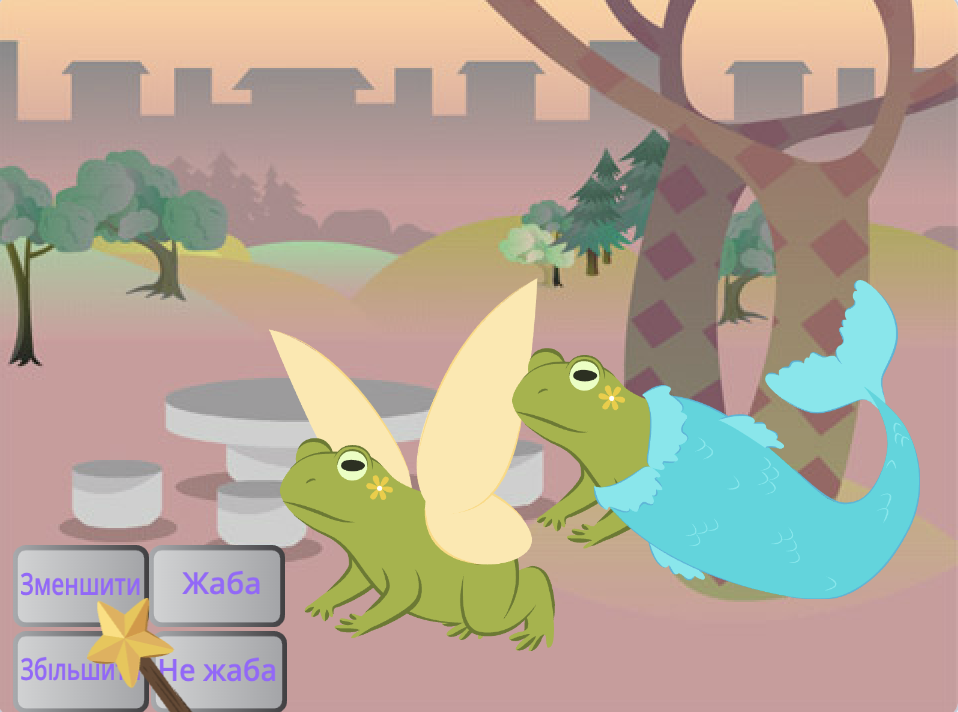
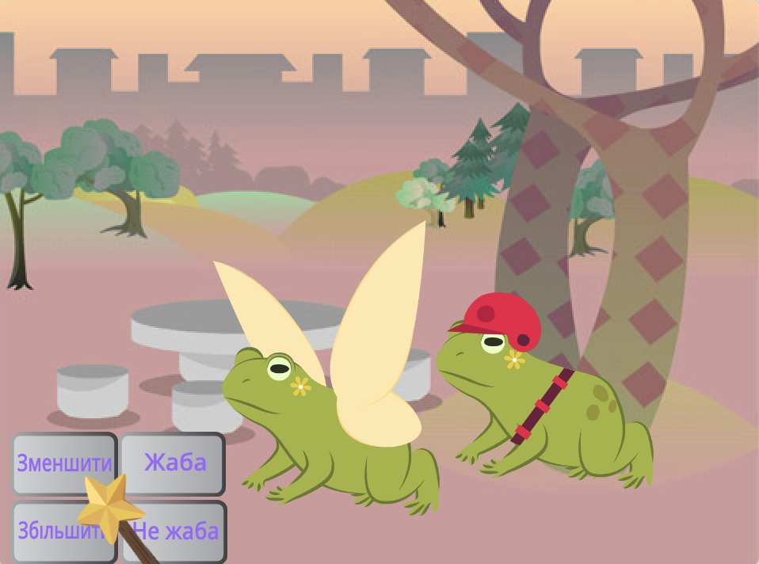
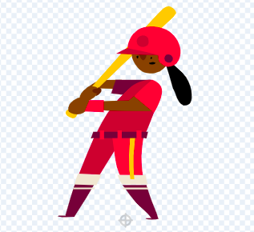
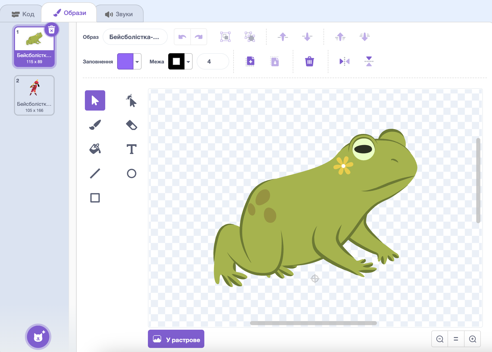
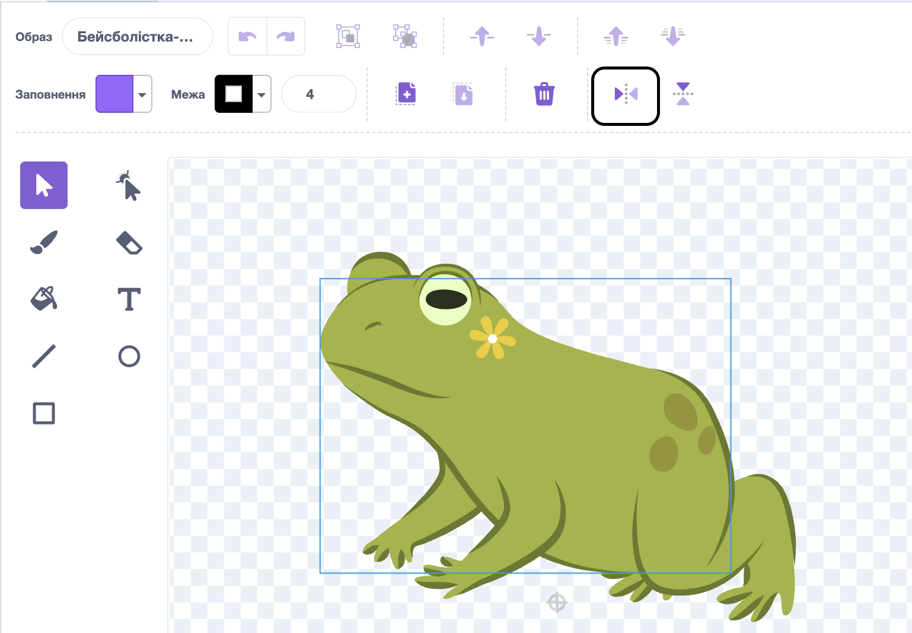

## Додай ще одного персонажа

Додай ще один спрайт на вибір, який відповідатиме на твої заклинання. Тобі потрібно буде створити варіант жабʼячого образу для спрайту й додати код, щоб образ змінювався з передачею повідомлення про заклинання.

{:width="300px"}

--- task ---

Скопіюй спрайт **Fairy**.

Видали образи **Фея-а** і **Фея-жаба-а**. У тебе залишиться лише образ **жаби**.

Додай до **нового спрайту** будь-який образ.

Ми вибрали **Batter** («Бейсболістка»):

Тобі може знадобитися змінити напрямок, куди дивиться спрайт.

**Порада:** якщо твій спрайт перевернувся, можна змінити його `стиль обертання`{:class="block3motion"} на `зліва-направо`{:class="block3motion"} у панелі властивостей спрайтів або за допомогою блока коду.

--- /task ---

Коли ти збільшуєш або зменшуєш спрайт, бажано, щоб його ноги залишалися на тому самому місці.

--- task ---

Спочатку вибери інструмент **Обрати** (стрілочка), щоб накреслити прямокутник навколо образу, а потім натисни **Групувати**. Потім перетягни свого персонажа, щоб він став над прицілом.

--- /task ---

--- task ---

Клацни на образ **Жаба**.

Перейменуй образ, щоб назва відповідала спрайту. Ми використали назву **Бейсболістка-жаба-а**.

--- /task ---

--- task ---

Якщо образ жаби дивиться в протилежну сторону від основного образу, ти можеш натиснути на **Право-ліво**.

--- /task ---

Тепер тобі потрібно зробити так, щоб жаба виглядала схожою на персонажа. Поєднання двох образів таким способом називається «мешап».

--- task ---

Ти можеш додати невелику деталь, як-от кольорову пляму, або скопіювати і вставити окуляри чи капелюх у редакторі малювання.

**Порада:** ти можеш додати будь-який образ до спрайту персонажа. Вибери інструмент **Обрати** (стрілочка), потім натисни на **Копія** або **Вставити**.

**Порада:** ти можеш згрупувати всі елементи образу. Вибери їх (за допомогою інструменту **Обрати** або <kbd> Ctrl-a</kbd>) і натисни **Групувати**.

Наша Бейсболістка-жаба виглядає так: 

--- /task ---

--- task ---

Перейди до вкладки **Код** для твого нового спрайта.

Зміни всі блоки `змінити образ на`{:class="block3looks"}, щоб вони використовували правильні образи для твого спрайту.

Ти також можеш змінити початковий `розмір`{:class="block3looks"} спрайту `коли зелений прапорець натиснуто`{:class="block3events"}.

--- /task ---

--- task ---

**Тест:** натисни на кнопки заклинань — обидва персонажі повинні реагувати на оповіщення.

**Усунення помилок:** перевір, чи ти змінив/-ла образи у блоці `змінити образ на`{:class="block3looks"} для твого нового спрайту.

--- /task ---

--- save ---
