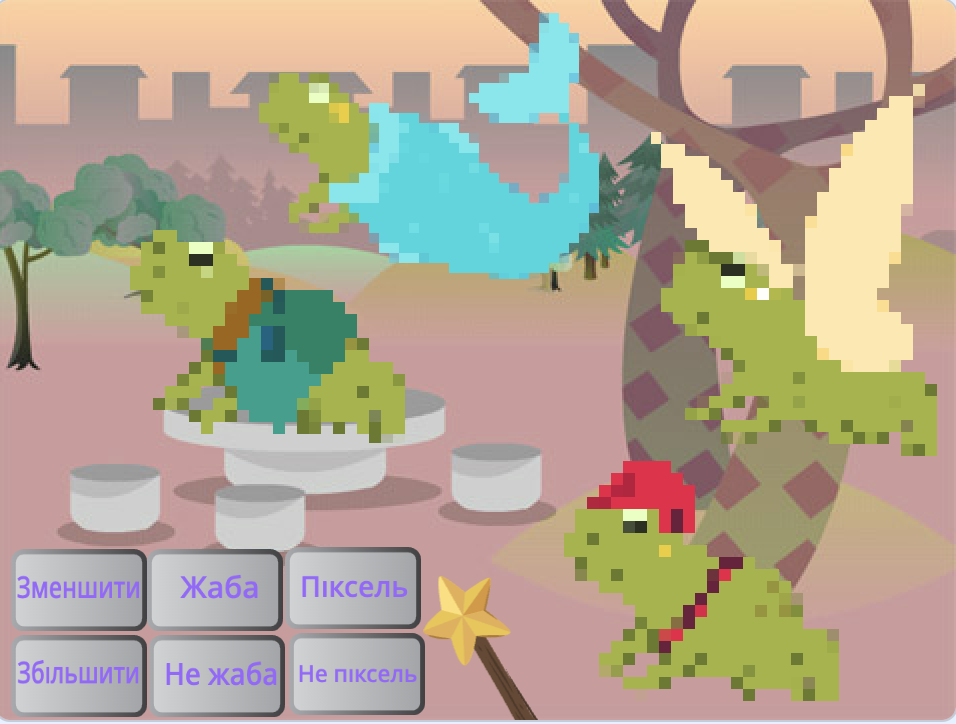
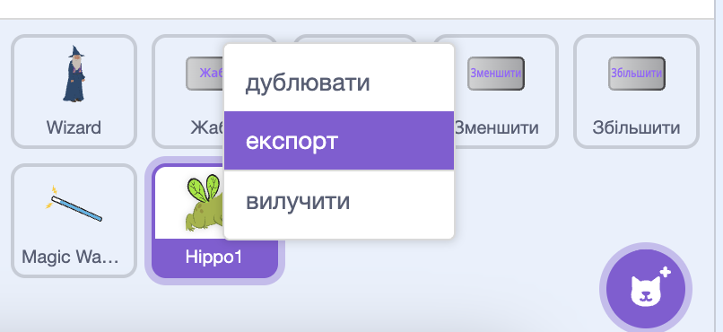
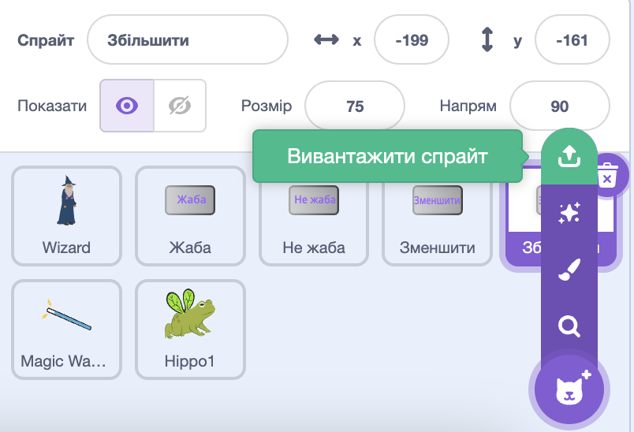

## Вдоскональ свій проєкт

Як ти розшириш свій чарівний світ? Ти можеш:
+ додати більше персонажів;
+ додати різні звуки та візуальні ефекти до чарівної палички;
+ додати більше заклинань, — ти можеш зробити так, щоб персонажі зникли та зʼявилися знову за допомогою блоків `сховати`{:class="block3looks"} й `показати`{:class="block3looks"}, застосувати візуальні ефекти або перевернути їх догори дриґом.

Чому б не обмінятися персонажами з другом? Спершу обміняйся з другом посиланнями на проєкт, щоб побачити спрайти одне одного. Щоб зберегти ці спрайти, використовуй свій Сховок або завантаж спрайти у місце зі спільним доступом. Потім повернись до свого проєкту та додай збережені спрайти.

[[[scratch-backpack]]]

--- collapse ---
---
title: Завантаж спрайт
---

Ти можеш зберегти спрайти на свій компʼютер, завантаживши їх зі свого проєкту. Клацни правою кнопкою миші по спрайту у списку спрайтів та вибери «експорт».

Щоб додати спрайт у проєкт, вибери «Вивантажити спрайт» у меню «Обрати спрайт».

--- /collapse ---

Створюйте більше заклинань з другом і додавайте їх до своїх персонажів. Вирішіть, які заклинання створити. Переконайтеся, що ви обоє використовуєте однакові назви для повідомлень, якими оповіщуєте.

--- collapse ---
---
title: Завершений проєкт
---

Ти можеш переглянути [завершений проєкт тут](https://scratch.mit.edu/projects/518413238/){:target="_blank"}.

--- /collapse ---

--- save ---
